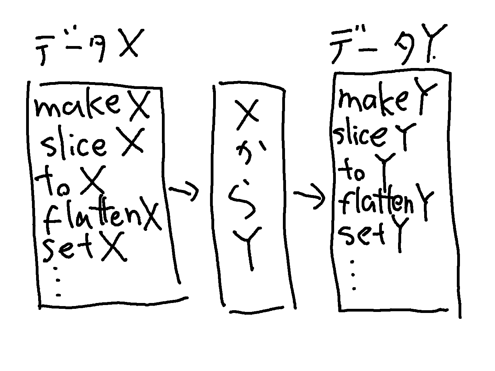

# 1章 関数型JavaScriptへのいざない

## 1.1 JavaScriptに関する事実

JavaScript言語は関数型プログラミングの手法をサポートしている。

```javascript
[1, 2, 3].forEach(aleat);
// アラート"1"がポップアップ
// アラート"2"がポップアップ
// アラート"3"がポップアップ
```

Array#forEachメソッドは、引数として渡した関数に配列のそれぞれの要素を順番に渡して実行する。

JavaScriptは、内部処理のために関数を引数として取るような様々な関数やメソッドを用意している。

例として、すべてのJavaScript関数が持つapplyメソッドが挙げられる。このメソッドに関数と配列を渡して呼び出すと、その配列を関数の引数として関数を実行することができる。

ここでapplyを使って、splat関数を作成してみる。このsplat関数に関数を渡して実行すると、新たな関数を生成して戻り値として返す。

```javascript
function splat(fun) {
    return function(array) {
        return fun.apply(null, array);
    };
}

var addArrayElements = splat(function(x, y) { return x + y });

addArrayElements([1, 2]);
//=> 3
```

JavaScriptの関数は、渡す引数のデータ型を問わず、その数も限定されない。そして、任意の時点で実行することができる。

ここでsplatの逆の機能を持つunsplatという関数を作る。unsplatは関数を引数に取り、別の関数を返す。返された関数は、渡された引数をもとの関数に渡して実行する。

```javascript
function unsplat(fun) {
	return function() {
		return fun.call(null, _.toArray(arguments));
	};
}

var joinElements = unsplat(function(array) { return array.join(' ') });

joinElements(1, 2);
//=> 1 2

joinElements('-', '$', '/', '!', ':');
//=> "- $ / ! :"
```

JavaScriptでは、すべての関数内でargumentsというローカル変数にアクセスすることができる。argumentsは配列に似た構造体で、関数呼び出し時に引数として与えられた値を保持する。

## 1.2 関数型プログラミングを始めるために

関数型プログラミングとは、値を抽象の単位に変換する関数を使用して行うプログラミングであり、それらを使ってソフトウェアシステムを構築することである。

関数型プログラミングを実現するための触媒として使用するライブラリはUnderscoreである。Underscoreは殆どの場合において、この簡略化された関数型プログラミングの基本定義に沿っている。

### 1.2.1 なぜ関数型プログラミングが必要なのか

オブジェクト指向プログラミングの主なゴールは問題をパーツに分解することである。同様に、関数型プログラミングも問題をパーツに分解する。しかしこの場合のパーツは関数である。

オブジェクト指向のアプローチは問題を「名詞」のグループに分解する傾向があることに対し、関数型のアプローチでは問題を「動詞」(関数)のグループに分解する傾向がある。オブジェクト指向プログラミングと同様に、よりハイレベルな動作をする大きな関数は、他の複数の小さい関数を紐付け、もしくは「合成」することにより形作られる。

関数のパーツでシステムを構成する方法のひとつとして、関数もしくは合成された関数を通して、与えられた値を異なる値に徐々に「変換」することができる。(例: テキスト->HTML->編集されたHTML)

オブジェクト指向を採用しているシステムでは、オブジェクト間の作用はそれぞれのオブジェクトの内部的な変更を伴い、多数の小さな、もしくはとても小さな状態の変更の集合体としてのシステム全体の状態にたどり着く。

これに対して、関数型のシステムは、観察しておかなければならないような状態変更を最小限に抑えるように務める。したがって、関数型の原則に則って構築されたシステムに新たな機能を加える際には、局所的、そして破壊的データ変換を伴わない(オリジナルデータが決して変更されない)状況下で、新しい関数がどのように動作するのかを理解することのみが求められる。

関数型プログラミングの原則に則ったシステムとは、原料をいれると徐々に製品を組み立てていく組立ラインの機械であると表現できる。

関数型プログラミングとは、命令形プログラミングで構築したシステムをモジュール化するために、可能な限りの明示的な状態変更を取り除く際に発生するものである。(Hughes 1984) 実践的な関数型プログラミングは状態変更を完全に消滅させることではなく、システム内で発生する変更を可能な限り小規模に、少ない回数に抑えることである。

### 1.2.2 抽象単位としての関数

抽象化を行う方法のひとつは、関数がその実装の詳細を隠蔽することである。隠蔽は、UNIXコミュニティで長く親しまれている Butler Lampson の格言を守らせてくれる美しい仕事の単位である。

``` 実行させ、正しく実行させ、早く実行させろ```

同様に、抽象としての関数を使うと Kent Beck のTDD(テスト駆動開発)の格言を満たすことができるようになる。

``` まず実行させ、次に正しく実行させ、そして早く実行させろ```

例えば、エラーや警告をレポートする場合には、次のようなコードを書くことがある。

```javascript
function parseAge(age) {
    if (!_.isString(age)) throw new Error("引数は文字列である必要があります");
    var a;
    
    console.log("ageを数値に変換しようとしています");
    
    a = parseInt(age, 10);
    
    if (_.isNaN(a)) {
        console.log(["ageを数値に変換できませんでした : ", age].join(''));
        a = 0;
    }
    
    return a;
}

parseAge("42");
// ageを数値に変換しようとしています
//=> 42

parseAge(42);
// Error: 引数は文字列である必要があります

parseAge("frob");
// ageを数値に変換しようとしています
// ageを数値に変換できませんでした : frob
//=> 0
```

parseAge関数は記述されたとおりに動作しているが、エラーや警告、そして情報の出力内容を変えたい場合、それぞれを出力する行を適宜変更しなければならない。ここでのよりすぐれたアプローチは、エラーや警告、そして情報を関数に「抽象化」することである。

```javascript
function fail(thing) {
    throw new Error(thing);
}

function warn(thing) {
    console.log(["警告 : ", thing].join(''));
}

function note(thing) {
    console.log(["情報 : ", thing].join(''));
}

function parseAge(age) {
    if (!_.isString(age)) fail("引数は文字列である必要があります");
    var a;
    
    note("ageを数値に変換しようとしています");
    
    a = parseInt(age, 10);
    
    if (_.isNaN(a)) {
        warn(["ageを数値に変換できませんでした : ", age].join(''));
        a = 0;
    }
    
    return a;
}
```

### 1.2.3 カプセル化と隠蔽

JavaScriptは、データ操作を行うメソッドとデータを一緒にカプセル化できるオブジェクトシステムを提供する。カプセル化は特定の要素の可視範囲を制限するために使われることもあり、これをデータ隠蔽(または単に隠蔽)という。JavaScriptのオブジェクトシステムはデータを直接隠蔽する方法は用意していない。そのため、データを隠蔽する場合は、クロージャと呼ばれるものを使用する。クロージャは関数の一種である。

### 1.2.4 動作単位としての関数

データと動作を隠蔽することは(より「軽い」データ変更方法を提供するという副作用をもっている)、関数を抽象の対象の単位にする方法のひとつに過ぎない。抽象の意味とは、個別の基本的な動作を保持し、あちこちで使いまわすための簡単な方法を提供することである。例えば、インデックスを使用して配列の要素を指定するJavaScriptの文法を考える。

```javascript
const letters = ['a', 'b', 'c'];

letters[1];
//=> 'b'
```

配列のインデックス指定はJavaScriptの基本動作だが、この動作を保持しておいて後で好きなように使いまわすためには、関数に閉じ込めておく以外に方法はない。したがって、ここでは配列のインデックス指定を行うシンプルな関数を構築する。この関数を nth と呼ぶ。

```javascript
function nativeNth(a, index) {
    return a[index];
}

nativeNth(letters, 1);
//=> "b"
```

nativeNth 関数は引数に期待値通りの値を与える場合は完璧に動作する。しかし、予期しない値を与えるとうまく動作しない。

```javascript
nativeNth({}, 1);
//=> undefind
```

nth 関数を使って抽象化を行いたいと思った場合、次のように関数を説明する。「nth 関数は、インデックス指定可能なデータ型を持ったデータから、有効なインデックスで指定される要素を返す。」与えられたものがインデックス指定可能なデータ型かどうかを見分けるために、isIndexed 関数を作ることができる。

```javascript
function isIndexed(data) {
    return _.isArray(data) || _.isString(data);
}
```

このような抽象と別の抽象を組み合わせることによって、nth の完全な実装を行うことができる。

```javascript
function nth(a, index) {
    if(!_.isNumber(index)) fail("インデックスは数値である必要があります");
    if(!isIndexed(a)) fail("インデックス指定可能ではないデータ型はサポートされていません");
    if((index < 0) || (index > a.length -1)) fail("指定されたインデックスは範囲外です");
    return a[index];
}
```

isIndexed 関数を使って nth 関数を抽象化したように、2番めの要素を返す動作を抽象化した second 関数を作ることができる。

```javascript
function second(a) {
    return nth(a, 1);
}
```

JavaScriptにおける別の基本的な動作の単位として、コンパレータ(comparator)という考え方がある。コンパレータは２つの値を引数に取り、１つ目の引数が２つ目よりも小さい場合に負の値を、大きい場合に正の値を、そして等しい場合に0を返す。JavaScriptネイティブのArray#sortメソッドもこのような機能を提供しているように見える。

```javascript
[2, 3, -6, 0, -108, 42].sort();
//=> [-108, -6, 0, 2, 3, 42]
```

この場合はうまく動作しているように見える。しかし、数値の組み合わせを変えて実行すると問題が発生する。

```javascript
[0, -1, -2].sort();
//=> [-1, -2, 0]

[2, 3, -1, -6, 0, -108, 42, 10].sort();
//=> [-1, -108, -6, 0, 10, 2, 3, 42]
```

Array#sortメソッドに引数を渡さない場合は、配列内の要素を文字列に変換して、辞書順にソートを行う。しかし、このメソッドがコンパレータ関数を引数に取ることを知るJavaScriptプログラマは次のように記述する。

```javascript
[2, 3, -1, -6, 0, -108, 42, 10].sort(function(x, y) {
    if (x < y) return -1;
    if (y < x) return 1;
    return 0;
});
//=> [-108, -6, -1, 0, 2, 3, 10, 42]
```

この記述方法は以前よりもましに見えるが、さらに汎用的にできる。他の場所で同じようなソートを行う必要があるため、この関数を無名関数として記述するのではなく、名前を与えておくほうがよいだろう。

```javascript
function comparelessThanOrEqual(x, y) {
	if (x < y) return -1;
	if (y < x) return 1;
	return 0;
}

[2, 3, -1, -6, 0, -108, 42, 10].sort(comparelessThanOrEqual);
//=> [-108, -6, -1, 0, 2, 3, 10, 42]
```

comparelessThanEqual関数の問題は、「コンパレータっぽさ」に従っているため、汎用的な比較の操作が簡単に行うことができない場合がある。

```javascript
if (comparelessThanOrEqual(1, 1)) console.log("同じか小さい");

// (何も出力しない)
```

思い通りの動作を実現するためには、comparelessThanOrEqual関数がコンパレータであることを予め知っている必要がある。

```javascript
if (_.container([0, 1], comparelessThanOrEqual(1, 1))) console.log("同じか小さい");
```

しかしこれはあまり満足のいくものではない。将来他の開発者がやってきて、comparelessThanOrEqual関数の1つ目の引数の方が小さい場合の戻り値を-42に修正してしまうかもしれない。comparelessThanOrEqualのよりよい書き方のひとつとして、次のような記述ができる。

```javascript
function lessOrEqual(x, y) {
    return x <= y;
}
```

このように、常に真偽値(trueもしくはfalse)を返す関数をプレディケート(predicate)という。手の混んだコンパレータとは違い、lessOrEqualは <= 演算子の単純な「スキン」である。

```javascript
[2, 3, -1, -6, 0, -108, 42, 10].sort(lessOrEqual);
//=> [42, 10, 3, 2, 0, -1, -6, -108]
```

sortメソッドは引数としてコンパレータ関数を期待するが、lessOrEqual関数はtrueもしくはfalseのみを返す。そこで、if/then/elseといった決まり文句をたくさんコピーすることなく、プレディケートをコンパレータの世界に適用させる必要がある。そのためには、プレディケート関数を引数にとり、その関数をコンパレータ関数に変換する関数を定義することで解決する。

```javascript
// truthy関数は後ほど定義される。

function comparator(pred) {
    return function(x, y) {
        if (truthy(pred(x, y)))
            return -1;
        else if (truthy(pred(x, y)))
            return 1;
        else
            return 0;
    };
}
```

このcomparator関数を使って、lessOrEqualのようなプレディケート関数が返す値(trueもしくはfalse)をコンパレータが返すような値 (-1, 0, 1) に「マッピング」することができる。

関数型プログラミングでは、ある型を持ったデータを、他の型を持ったデータの世界に引っ張りこむように作用する関数をとてもよく目にすることになる。

```javascript
[100, 1, 0, 10, -1, -2, -1].sort(comparator(lessOrEqual));
//=> [-2, -1, -1, 0, 1, 10, 100]
```

comparator関数は「true」もしくは「false」の値を返すすべての関数を、コンパレータの型にマッピングする。このcomparator関数は、関数を引数にとり新しい関数を生成して返すが、このような関数は「高階関数」と呼ばれる。また、プレディケートがcomparator関数によりコンパレータに変換されても意味をなさない場合があることに注意する。

### 1.2.5 抽象としてのデータ

JavaScriptが提供するプリミティブやオブジェクト、配列を使って、クラスベースのデータモデリング作業の多くを代替することが可能である。関数型プログラミングは歴史的に、ハイレベルな動作の基礎となる関数を構築することと、非常にシンプルなデータ構造体を操作することの2点を中心に据えている。

CSVファイルを処理するJavaScriptアプリケーションを書くように言われた場面を想像する。以下のようなCSVファイルを持っているとする。

```
name,	age,	hair
Merble,	35,		red
Bob,	64,		blonde
```

このデータが3つのデータ列 (name, age, hair) と3つの行 (ヘッダ行と、2つのデータ行) を持っていることは明らかである。文字列として窮屈に収納されているCSVをパースする関数を以下のように実装する。

```javascript
function lameCSV(str) {
    return _.reduce(str.split("\n"), function(table, row) {
        table.push(_.map(row.split(","), function(c) { return c.trim() }));
        return table;
    }, []);
}
```

lameCSV関数は文字列を \n で行に分割し、それぞれの行を処理し、行のそれぞれのデータセルから余計なホワイトスペースを削除する。データテーブル全体が子配列を格納した配列となり、それぞれの子配列は文字列要素を格納している。次の表に示されている概念図のように、ネストされた配列はテーブルとして表示することができる。

| name   | age  | hair   |
| ------ | ---- | ------ |
| Merble | 35   | red    |
| Bob    | 64   | blonde |

lameCSVを使って、文字列として保存されているデータをパースする。

```javascript
const peopleTable = lameCSV("name,age,hair\nMerble,35,red\nBob,64,blonde");

peopleTable;
//=>	[["name",	"age",	"hair"],
//		["Merble",	"35",	"red"],
//		["Bob",		"64",	"blonde"]]
```

関数型プログラミングでは、lameCSVや前に定義した comparator などの関数が、あるデータ型を別のデータ型に変換するための鍵となる。



データ表現を最小限におさえておくことで、配列の要素や既に存在する配列処理の関数やメソッドをそのまま利用することができる。

```javascript
_.rest(peopleTable).sort();
//=>	[["Bob", "64", "blonde"],
//		["Merble", "35", "red"]]
```

また、オリジナルデータの構造はあらかじめ分かっているので、分かりやすく適切に命名されたセレクタ関数を生成して、特定のデータにアクセスすることができる。

```javascript
function selectNames(table) {
    return _.rest(_.map(table, _.first));
}

function selectAges(table) {
    return _.rest(_.map(table, second));
}

function selectHairColor(table) {
    return _.rest(_.map(table, function(row) {
        return nth(row, 2);
    }));
}

var mergeResults = _.zip;

selectNames(peopleTable);
//=> ["Merble", "Bob"]

selectAges(peopleTable);
//=> ["35", "64"]

selectHairColor(peopleTable);
//=> ["red", "blonde"]

mergeResults(selectNames(peopleTable), selectAges(peopleTable));
//=> [["Merble", "35"], ["Bob", "64"]]
```


### 12.6

```javascript
// 引数が null と undefined ではないことを示す関数
function existy(x) { return x != null };

// 引数が true とみなされるかどうかを判定する関数
function truthy(x) { return (x !== false) && existy(x) };
```

